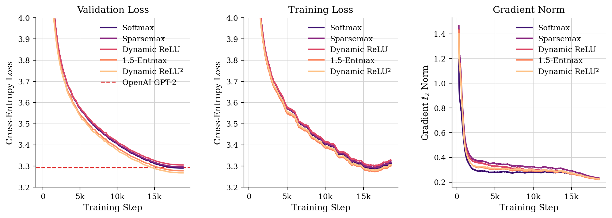
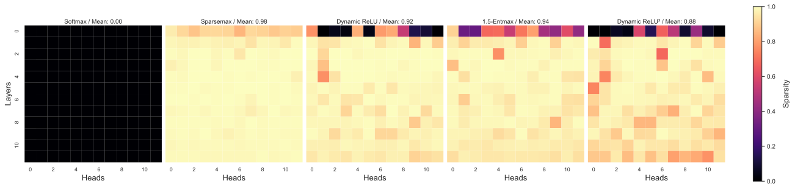
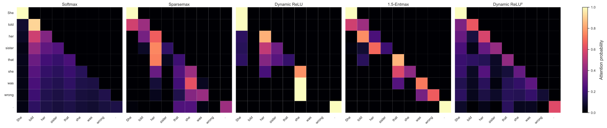

# A Comparative Study of Attention Score Functions in GPT-2

Designing better attention mechanisms is an active area of research in transformers, with work ranging from efficient approximations to structured sparse alternatives. Most of this work, however, focuses on efficiency or is evaluated on fine-tuning tasks rather than pretraining from scratch. This project trains five GPT-2 small models from scratch, each with a distinct attention score function (Softmax, Sparsemax, 1.5-Entmax, Dynamic ReLU, and Dynamic ReLU²), and systematically evaluates the effect on training dynamics, commonsense reasoning accuracy, and per-head attention sparsity.

**Research Question:** How do different attention score functions impact model quality and training efficiency in GPT-2 pretraining?

## What it Does

This project investigates how replacing the standard softmax attention score function in GPT-2 affects language model training dynamics, downstream task performance, and attention sparsity. The five attention mechanisms compared are Softmax (baseline), Sparsemax, 1.5-Entmax, Dynamic ReLU, and Dynamic ReLU² (the last two being novel variants introduced in this project).

All five share the same scaled dot-product pre-step $s_{ij} = q_i \cdot k_j / \sqrt{d_k}$ with causal masking and differ only in how those raw scores are mapped to attention weights.

- **Softmax** $\quad a_i = e^{s_i} / \sum_j e^{s_j}$
- **Sparsemax** (Martins & Astudillo, 2016) $\quad a_i = (s_i - \tau)_+$, $\tau$ has to be such that $\sum_i a_i = 1$
- **1.5-Entmax** (Peters et al., 2019) $\quad a_i = (s_i / 2 - \tau)_+^2$ , $\tau$ has to be such that $\sum_i a_i = 1$
- **Dynamic ReLU**

  $$a_i = \frac{\operatorname{ReLU}(s_i - \max(s) + \sigma(\beta))}{\sum_j \operatorname{ReLU}(s_j - \max(s) + \sigma(\beta))}$$

- **Dynamic ReLU²**

  $$a_i = \frac{\operatorname{ReLU}\!\left(\dfrac{s_i - \max(s)}{2} + \sigma(\beta)\right)^{\!2}}{\sum_j \operatorname{ReLU}\!\left(\dfrac{s_j - \max(s)}{2} + \sigma(\beta)\right)^{\!2}}$$

Softmax is always dense. Sparsemax projects onto the probability simplex, setting tokens below a threshold τ to exactly zero. 1.5-Entmax sits between these two being able to output sparse distributions which tends to be less sparse (or denser) than sparsemax. Dynamic ReLU, inspired by Wortsman et al. (2023), replaces the exponential with a ReLU shifted by σ(β) = sigmoid(β), where β is a raw unconstrained scalar that each head learns independently, controlling how wide the head's attention window is at each position. Dynamic ReLU² additionally scales the dot products by 0.5 before applying the same shift, so the full score difference $(s_i - \max(s))$ is halved before the ReLU, and then the surviving scores are squared before renormalization, concentrating weight more heavily on the highest-scoring tokens.

All five variants are trained from scratch on the FineWeb-10B dataset (~9.8B tokens over 18,865 steps) using an identical GPT-2 small architecture (124M parameters) and training configuration, making the attention mechanism the only variable. Models are evaluated on validation cross-entropy loss, HellaSwag commonsense reasoning accuracy, per-layer per-head attention sparsity, and training throughput. Results show that 1.5-Entmax achieves the best HellaSwag normalized accuracy (30.23%) while Dynamic ReLU² achieves the lowest validation loss (3.268), and that sparse attention mechanisms like Sparsemax produce dramatically sparser attention patterns (98.3% zeros on average) compared to the dense Softmax baseline.

## Quick Start

**1. Set up the environment**
```bash
conda env create -f environment.yml
conda activate cs372
```

**2. Download and tokenize the data**
```bash
python data/fineweb.py --type classic --version 10B
```
This downloads FineWeb-10B from HuggingFace and writes tokenized `.bin` shards to `data/fineweb10B/`.

**3. Train a model**

Edit `run_training.sh` to set `ATTN_TYPE` to one of: `softmax`, `sparsemax`, `entmax15`, `dynamic_relu`, `dynamic_relu_square`. Then run:
```bash
bash run_training.sh
```
Logs are written to `src/logs/` and checkpoints to `models/ckpts/`.

**4. Evaluate on HellaSwag**
```bash
python src/eval_gpt2.py --model_path models/ckpts/ckpt_softmax.pt
```

**5. Generate figures**
```bash
# training curves
python src/plot_logs.py

# per-layer per-head sparsity heatmaps
python src/sparsity.py

# attention maps for a sample phrase
python src/attention_map.py
```

**6. Compile the ablation table**

Requires a LaTeX distribution. See [SETUP.md](SETUP.md) for installation instructions.
```bash
cd src/figures && pdflatex ablation_table.tex
```

Figures are saved to `src/figures/`.

## Video Links

- **Demo:** 
- **Technical Walkthrough:** 

## Results

All five models were trained identically (GPT-2 small, 18,865 steps, FineWeb-10B, cosine LR schedule with warmup, AdamW with weight decay 0.1, gradient clipping 1.0, bfloat16).

| Attention | Val Loss | HellaSwag Acc Norm | Mean Sparsity | Throughput |
|---|---|---|---|---|
| Softmax | 3.2908 | 30.06% | 0.00% | 363k tok/s |
| Sparsemax | 3.2960 | 29.76% | 98.29% | 171k tok/s |
| 1.5-Entmax | 3.2780 | **30.23%** | 93.62% | 161k tok/s |
| Dynamic ReLU | 3.3052 | 29.64% | 91.95% | 259k tok/s |
| Dynamic ReLU² | **3.2680** | 29.89% | 88.39% | 254k tok/s |
| OpenAI GPT-2\* | 3.2924 | 29.40% | 0.00% | N/A |

\* original OpenAI checkpoint evaluated on FineWeb val and HellaSwag by Karpathy (2024).



All five mechanisms converge to comparable validation loss, spanning a narrow range from 3.268 to 3.305. Dynamic ReLU², a sparse mechanism, achieves the lowest validation loss of any variant including the softmax baseline, suggesting that concentrating attention onto the highest-scoring tokens provides a useful inductive bias during pretraining at this scale. 1.5-Entmax achieves the best HellaSwag normalized accuracy (30.23%), indicating that intermediate sparsity may transfer better to downstream reasoning. Throughput costs vary significantly across mechanisms and are reported in the table above.



The sparsity heatmaps show that different mechanisms produce structurally different attention patterns across layers and heads. Sparsemax is the most aggressive, with 98.3% zeros on average, attending to fewer than 2% of tokens per query position in the later layers. The Dynamic ReLU variants show high variance across heads, with some heads remaining nearly dense while others approach the sparsity of Sparsemax. This variation comes from the learned per-head β parameter, which adapts the effective attention threshold independently for each head. The central tradeoff is made visible here. Sparse mechanisms yield more interpretable and concentrated attention patterns, but the projection operations that produce those distributions carry a substantial throughput cost relative to softmax.



Each map shown above was drawn from a single representative head and layer for each model variant. The heads were chosen independently to illustrate what each mechanism looks like qualitatively and are not selected to represent the same functional role across models. Within any single model, different heads and layers specialize in structurally different patterns, so cross-model comparison at the level of individual heads is limited. The most visible distinction is density. Softmax distributes weight broadly across the context, while the sparse mechanisms produce visibly concentrated patterns with large zero regions, attending to a small fraction of positions even for long sequences.

## Individual Contributions

Solo project!